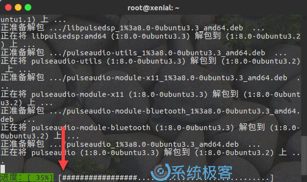
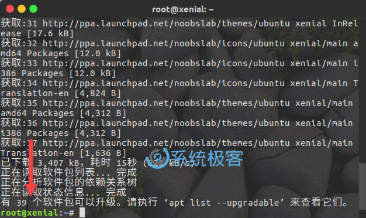

# Linux 中 apt 和 apt-get的区别

## 背景

在开始对比 apt 与 apt-get 命令的区别之前，我们先来看看这两个命令的背景，以及它们要试图达到的目的。

Debian 作为 Ubuntu、Linux Mint 和 elementary OS 等 Linux 操作系统的母板，
其具有强健的「包管理」系统，它的每个组件和应用程序都内置在系统中安装的软件包中。
Debian 使用一套名为 Advanced Packaging Tool（APT）的工具来管理这种包系统，
不过请不要把它与 apt 命令混淆，它们之间是其实不是同一个东西。

在基于 Debian 的 Linux 发行版中，有各种工具可以与 APT 进行交互，以方便用户安装、删除和管理的软件包。
apt-get 便是其中一款广受欢迎的命令行工具，另外一款较为流行的是 Aptitude 这一命令行与 GUI 兼顾的小工具。

你可能遇到过许多类似的命令，如apt-cache、apt-config 等。如你所见，这些命令都比较低级又包含众多功能，
普通的 Linux 用户也许永远都不会使用到。换种说法来说，就是最常用的 Linux 包管理命令都被分散在了
apt-get、apt-cache 和 apt-config 这三条命令当中。

apt 命令的引入就是为了解决命令过于分散的问题，它包括了 apt-get 命令出现以来使用最广泛的功能选项，
以及 apt-cache 和 apt-config 命令中经常用到的功能。

在使用 apt 命令时，用户不必再由 apt-get 转到 apt-cache 或 apt-config，而且 apt 更加结构化，
并为用户提供了管理软件包所需的必要选项。

简单来说就是：apt = apt-get、apt-cache 和 apt-config 中最常用命令选项的集合。

## apt与apt-get之间的区别

通过 apt 命令，用户可以在同一地方集中得到所有必要的工具，apt 的主要目的是提供一种以「让终端用户满意」的方式来处理 Linux 软件包的有效方式。

apt 具有更精减但足够的命令选项，而且参数选项的组织方式更为有效。除此之外，它默认启用的几个特性对最终用户也非常有帮助。例如，可以在使用 apt 命令安装或删除程序时看到进度条。

apt 还会在更新存储库数据库时提示用户可升级的软件包个数。

## apt和apt-get命令之间的区别

虽然 apt 与 apt-get 有一些类似的命令选项，但它并不能完全向下兼容 apt-get 命令。
也就是说，可以用 apt 替换部分 apt-get 系列命令，但不是全部。

|apt 命令|取代的命令|命令的功能|
| - | - | - |
|apt install|apt-get install|安装软件包|
|apt remove|apt-get remove|移除软件包|
|apt purge|apt-get purge|移除软件包及配置文件|
|apt update|apt-get update|刷新存储库索引|
|apt upgrade|apt-get upgrade|升级所有可升级的软件包|
|apt autoremove|apt-get autoremove|自动删除不需要的包|
|apt full-upgrade|apt-get dist-upgrade|在升级软件包时自动处理依赖关系|
|apt search|apt-cache search|搜索应用程序|
|apt show|apt-cache show|显示装细节|

当然，apt 还有一些自己的命令

|新的apt命令|命令的功能|
| - | - |
|apt list|列出包含条件的包（已安装，可升级等）|
|apt edit-sources|编辑源列表|

## apt-get已弃用？

目前还没有任何 Linux 发行版官方放出 apt-get 将被停用的消息，至少它还有比 apt 更多、更细化的操作功能。
对于低级操作，仍然需要 apt-get。

## 我应该使用apt还是apt-get？

既然两个命令都有用，那么我该使用 apt 还是 apt-get 呢？作为一个常规 Linux 用户，
系统极客建议大家尽快适应并开始首先使用 apt。不仅因为广大 Linux 发行商都在推荐 apt，更主要的还是它提供了 Linux 包管理的必要选项。

最重要的是，apt 命令选项更少更易记，因此也更易用，所以没理由继续坚持 apt-get。

## 小结

最后结大家提供两点使用上的建议：

- apt 可以看作 apt-get 和 apt-cache 命令的子集, 可以为包管理提供必要的命令选项。
- apt-get 虽然没被弃用，但作为普通用户，还是应该首先使用 apt。