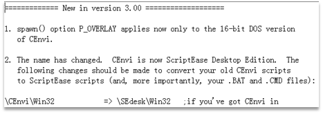
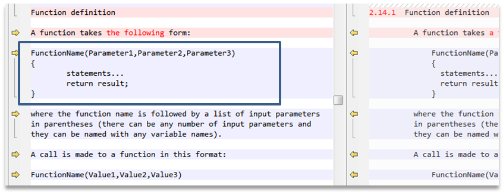
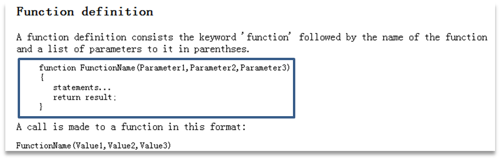
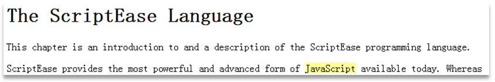
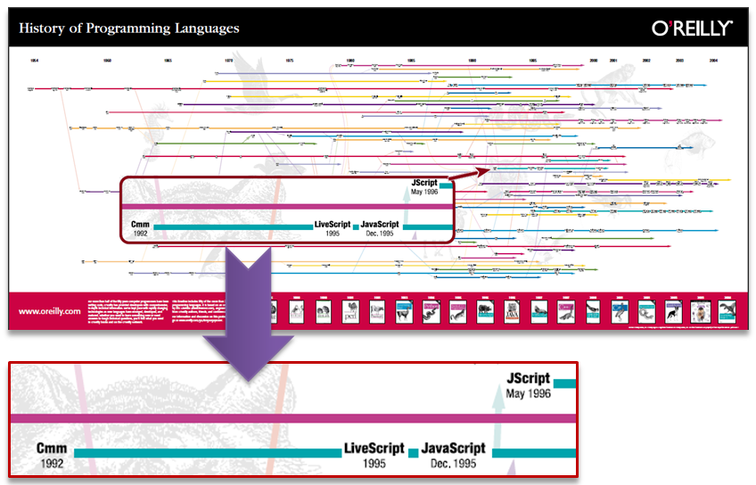

# CMM(C--)和JavaScript的关系

## CMM(C--)是什么

大概在 1992 年，一家称作 Nombas 的公司开发了一种叫做 C 减减（C-minus-minus，简称 Cmm）的嵌入式脚本语言。Cmm 背后的理念很简单：一个足够强大可以替代宏操作（macro）的脚本语言，同时保持与 C （和 C ++）足够的相似性，以便开发人员能很快学会。这个脚本语言捆绑在一个叫做 CEnvi 的共享软件中，它首次向开发人员展示了这种语言的威力。

Nombas 最终把 Cmm 的名字改成了 ScriptEase，原因是后面的部分（mm）听起来过于消极，同时字母 C “令人害怕”。

## 错误观点

“JavaScript在语源上继承自Cmm”。

这个错误的观点主要的来自于以下途径（部分）：

- 2002年10月7日的《Wired Magazine（连线杂志）》的一份名为“Mother Tongues”的图；
- O’Reilly公布的“The History of Programming Languages图；
- Levenez.com公布的“Computer Language History”；
- ……

这些明显是不太靠谱的一面之词。但是进一步援引这些内容的结果是：错误的观点被一再重述，似乎已经快要变成事实了，例如《JavaScript高级程序设计》一书中的早期版本，已经白底黑字地将这些内容记述在了“JavaScript简史”之中。

本文将简明而完整地厘清上述观点。

## 真相：Cmm与JavaScript完全无关，而ScriptEase不过是追随者

Cmm的确是一种脚本语言，比JavaScript出现得早很多。但这个脚本语言并不是嵌入式的，它需要一个名为CEniv的可执行程序，来运行这种扩展名为.cmm的脚本代码文件。因为Cmm一开始并没有设计为嵌入式语言，所以这些称为Espresso Pages的东西其实是一些可供下载的Demos，使用者需要安装CEnvi的某个版本，并通过一些配置来使Demo能在NN2 beta中使用。原文是：

```
but for now these demos use our CEnvi for Windows application as a helper. Instructions are on the page for how to configure, including a download of a demo of the Cmm interpreter.
```

现在已经再也找不到这些下载和操作指南了。不过我们这里并不想考察Espresso Pages的效果，而是想说清他当时所使用的Cmm语言与JavaScript语言有没有什么关系。因为当时JavaScript正在开发之中，而Cmm已经出现了三年之久，那么JavaScript的语言设计是否参考了Cmm呢？

目前可以下载到的CEnvi包括以下版本：

```
CEnvi 1.0 – 1993.08.09
CEnvi 1.008 – 1993.12.21
CEnvi 1.009 for DOS/Win/OS2 – 1994.11.29
CEnvi 2.0 for DOS/Win/OS2 – 1995.03.29
CEnvi 2.10 for DOS/Win/NT/OS2 – 1995.10.17
CEnvi 2.11 for DOS – 1996.02.20
```

在NN2之前的是CEnvi 2.0，NN2正式发布之后则有CEnvi 2.11。我们只需要考察这其中的Cmm语言的特性以及其进化的路线，就可以了解这一阶段中二者可能存在的相互影响。根据Cmm的语言手册(*3)，其主要的发展为：

```
1.0 ~ 2.0  :  添加了字符串中的转义字符(Escape Sequences for Characters)
2.0 ~ 2.1  :  无变化
2.1 ~ 2.11 :  无变化
```

也就是说，Cmm语言从1993年随CEnvi发布一直到1996年2月，下面的语言特性并没有任何实质性的变化：

- 与C语言相似的运算符（包括位运算、布尔运符和三元”?:”运算符等）、注释、字符串表达方式；
- 有Byte、Integer、Float等数据类型，不需要预声明变量，变量在第一次赋值时创建并关联类型；
- 有数组与字符串类型，数组不需要预定义长度或元素类型；字符串是字符类型的数组，可以通过数组下标存取；可以通过”...”方式，或用{...}声明一系列单个字符的方式来声明字符串；
- 有结构(Structures)数据类型，用“.”字符存取其字段；
- 有if、while、do、switch以及for等等语句，有GOTO语句；
- 可以声明函数，但不需要用function关键字开始，也不需要声明参数类型，参数个数必须是确定的。
- 有#include与#define等预声明语句；在任意函数之外的代码为初始化代码，其声明的变量为全局变量；在初始化代码之后执行的第一个函数为main(ArgCount, ArgStrings)。

可见Cmm语言的多数概念来自于C语言，而与JavaScript所体现的面向对象特性毫无关系。例如Cmm的数组是一个独立的数据类型，取得数组的长度应使用GetArraySpan(aArr)函数，而不是取数组这个对象的一个属性aArr.length。通过对Cmm语言特性的详细分析可见：即使JavaScript与Cmm存有一些相似的部分，那么最多也是其借鉴自C语言的表达式运算、语句语法等等，而这些并不足以成为“JavaScript语源自Cmm”的证据。

而在这个话题中的另一个角色，是名为“ScriptEase”的脚本语言，它也是最早符合ECMAScript 262标准的语言之一——简单的说，它也是一个JavaScript语言。而且，Nombas公司正是因此将Cmm与JavaScript挂上关系，因为他们声称：ScriptEase就是Cmm，只不过是换了个名字。

真的只是换了一个名字这样简单吗？

此前我们说过，Cmm的最后一个可见的发布包含在CEnvi 2.11中，发布时间是1996.02.20，其语言特性与上述列表一致（没有变化）。这个语言是什么时候更名的呢？答案是：晚于1997.02.06。因为在1997年4月至6月间，Nombas公司发布了CEnvi的3.0版本，在这个版本中首次使用到ScriptEase这个名字，其中的名为HISTORY的文件——该文件被打包的时间（令人惊奇地）是1997.02.06——描述这次更名的缘由：



那么在这个版本中的ScriptEase又具有什么样的语言特性呢？答案是：与Cmm 1.0~2.11相比仍然没有变化。对比该ScriptEase 3.0发布包中的语言手册《The ScriptEase Language》与Cmm 2.11中对应文档可知：数组、字符串、函数、GOTO语句等等一切，仍跟Cmm中一模一样。

但是这个原来叫Cmm的语言摇身一变，改名叫ScriptEase了。现在，请看下面这样的代码（语言手册对比，左侧为ScriptEase 3.0 - 1997.04.15文档，右侧为Cmm 2.11 – 1996.02.20文档）：



相信任何一个看过JavaScript代码的人都会明白，这个名为Cmm/ScriptEase的语言，所采用的函数声明的语法绝非JavaScript语法，也绝对不可能符合ECMAScript所定义的规范。而此时已是1997年，JavaScript 已经发布了两年，ECMAScript标准已即将发布（1997.06）。虽然现在的Cmm已经更名为ScriptEase，但在其语言手册中仍然找不到Object这样的词汇，代码上仍然使用着最初的函数声明语法。

那么，这样的一门语言又是何时摇身一变，以至于被误认为“JavaScript的语源”的呢。这一时间还要推进到半年之后，也就是1997年12月。这时ScriptEase发布了它的4.0版，在目前可以找到的一个名为“ScriptEase:WebServer Edition 4.01 – 1997.12.08”版本中（准确的说，我并没有找到3.0至4.0的全部发布过程），终于有了一份手册，开始采用如下的语法：



正是在这份ScriptEase官方手册中，写道：



现在这一切还需要解释吗？以下两个言论：

- ScriptEase在从3.0到4.0的过程中，采用了ECMAScript标准，进而实现了JavaScript的一个版本
- JavaScript语源自Cmm，继承了后者语言特性

之中，后者是何等的站不住脚？！然而，它正是这样地画在了O’Reilly的图册里(*4)：



## 结论

Cmm与JavaScript完全无关，而ScriptEase不过是追随者！
