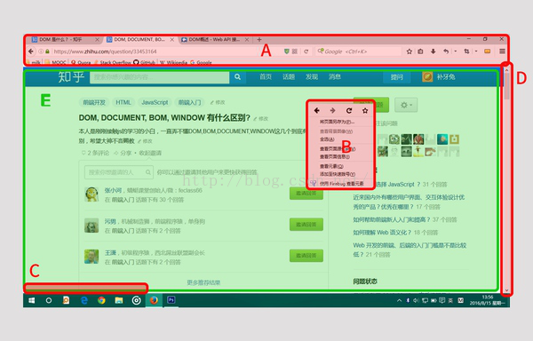

# DOM 和 BOM区别

## 简单解释

DOM（文档对象模型），是对浏览器（可看成容器）内的内容进行操作。DOM 是为了操作文档出现的 API，document 是其的一个对象
BOM（浏览器对象模型），是对浏览器本身进行操作。BOM 是为了操作浏览器出现的 API，window 是其的一个对象



- 归DOM管的：

```
E区（即 document，浏览器中的网页部分）
```

- BOM管的：

```
A区（浏览器的标签页，地址栏，搜索栏，书签栏，窗口放大还原关闭按钮，菜单栏等等）
B区（浏览器的右键菜单）
C区（document加载时的状态栏，显示http状态码等）
D区（滚动条scroll bar）
```

## 详细解释

### DOM

#### 什么是 DOM

DOM 全称是 Document Object Model，也就是文档对象模型。它是针对 HTML/XML 的基于树的 API。
在这个文档对象里，所有的元素呈现出一种层次结构，就是说除了顶级元素html外，其他所有元素都被包含在另外的元素中。
而这些元素都可以看作一个对象，叫做 node（节点）

举个例子，假如要将下面的 HTML 转化成一棵 DOM 树

```
<html>
    <head>
        <title>文档标题</title>
    </head>

    <body>
        <a href=“”>我的链接</a>
        <h1>我的标题</h1>
    </body>
</html>
```

转化效果


#### DOM 有什么用

DOM 就是为了操作 HTML 中的元素，比如说我们要通过 JS 修改网页的标题

```
document.title = "Hello World";
```

DOM 为访问，操作这些 node 提供了可能。

注意：一个浏览器窗口中可能有多个document。
例如，网页中嵌套了很多iframe元素，那么每个 iframe 中的 HTML 都是一个document。

#### 例子

```
document.getElementById("test")     // 根据id获取Node
document.title                      // 获取HTML的标题
```

### BOM

#### 什么是 BOM

BOM 全称是 Browser Object Model，也就是浏览器对象模型。

刚才说过 DOM 是为了操作文档出现的接口，那 BOM 顾名思义其实就是为了控制浏览器的行为而出现的接口。

浏览器可以做什么呢？比如跳转到另一个页面、前进、后退等等，程序还可能需要获取屏幕的大小之类的参数。
所以 BOM 就是为了解决这些事情出现的接口。比如我们要让浏览器跳转到另一个页面，只需要

```
location.href = "http://www.xxxx.com" // location 就是 BOM 里的一个对象。
```

BOM 的 window 包含了 document，因此可以直接访问 window 对象的 document，
进而通过 document 就可以访问、检索、修改 HTML 文档的内容与结构（因为 document 又可以操作 DOM）。

#### 例子

```
window.document             // 获取DOM
window.screen               // 获取浏览器屏幕信息
window.location             // 获取/控制用户页面URL
window.navigator            // 获取访问者浏览器信息
window.open("http://test.com")  // 打开一个新窗口
```

## 总结

可以说，BOM 包含了 DOM，浏览器提供出来给予访问的是 BOM，从 BOM 再访问到 DOM，最后操作节点node的内容，属性等。
