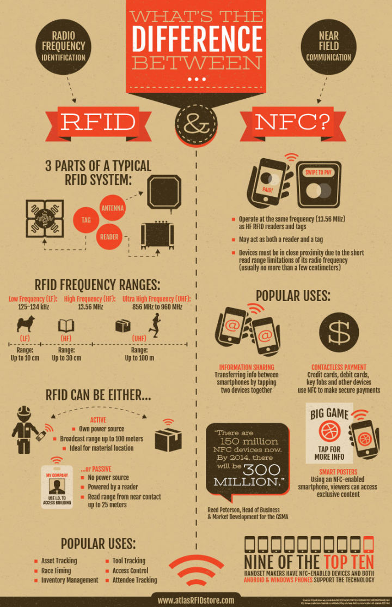

# RFID 和 NFC的区别

## 前言

RFID和NFC都是无线射频技术，这是他们最大的共同点，但是他们有什么区别呢？

## 解释

RFID是无线射频识别的笼统概念，根据频率划分包含低频、高频（13.56MHz）、超高频、微波等。
读写器可读写标签数据信息，作用距离取决于读写器功率、读写器天线增益值、标签天线尺寸等，
总的来说是这些值越大，距离就越远。

NFC频率也是13.56MHz，且兼容大部分RFID高频相关标准（有些是不兼容），但是规定NFC作用距离不能很远。

现在说不同点，RFID中的读写器和标签可以是一对多关系（低频和高频的14443是一对一），NFC铁定是一对一关系。
NFC可以有三种模式，模拟卡（标签）、模拟读卡器、点对点。
RFID不同频段标准不一样，数据格式也就不一样，NFC标准数据格式是NDEF格式。
虽然NFC也可以读一些高频标签，但是还是会发现有些高频标签不能读，
就是上面说的NFC兼容部分高频标准（这也跟NFC读卡芯片有关，不同厂家之间的技术壁垒），就是这个原因。

## 安全性

NFC只是限于13.56MHz的频段！而RFID的频段有低频（125KHz到135KHz），高频（13.56MHz）和超高频（860MHz到960MHz之间。
这种区别主要是由于，在一些设计现金支付、信用卡的应用中，RFID的通信距离情况下，
其他设备也可以收到个人RFID信息，存在不安全因素；而NFC工作有效距离约10cm，所以具有很高的安全性。
如果使用一些特殊的信号采集设备，可以在相当远的距离外读取到RFID的信息。

## 总结

最后是用一张图总结RFID 和 NFC的不同

