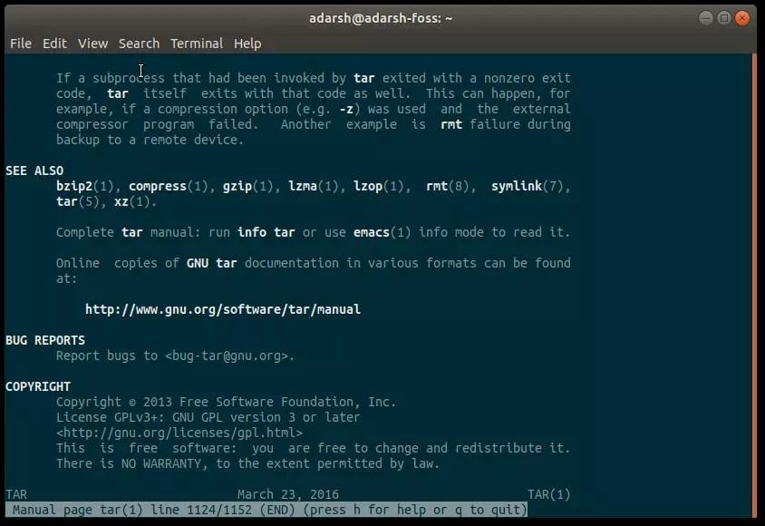
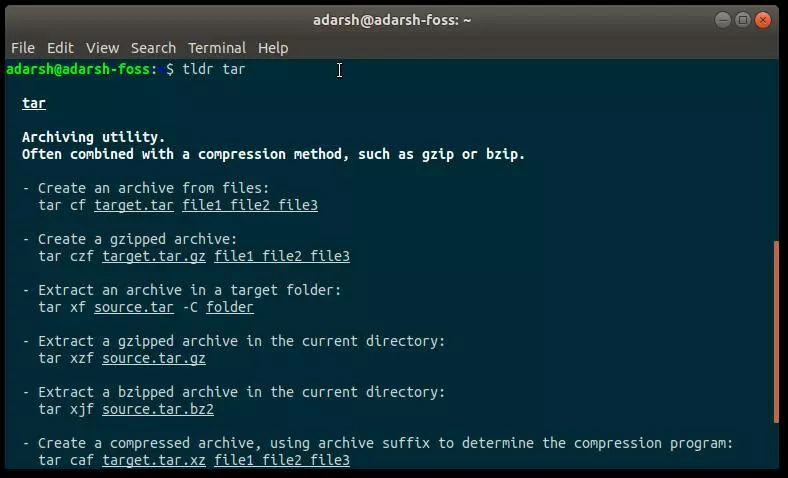

# TLRD Page 和 Man Page的关系

## 前言

在终端上使用各种命令执行重要任务是 Linux 桌面体验中不可或缺的一部分。
Linux 这个开源操作系统拥有丰富的命令，任何用户都无法全部记住所有这些命令。
而使事情变得更复杂的是，每个命令都有自己的一组带来丰富的功能的选项。

需要为用户提供一个随时查询命令使用方法的工具，于是Man Page应运而生。

## 解释

### Man Page

- 名称由来

Man Page全称为Manual Page(手册)，

- 介绍

Man Page 是 linux/unix 环境下命令与函数的帮助文档。
它是用英文写成的，包含了大量关于不同命令的深入信息。
但是有时候，当你在寻找命令的基本信息时，它就会显得有点庞杂。为了解决这个问题，人们创建了TLDR Page。

### TLRD Page

- 名字由来

源自俚语：Too Long; Didn't Read （太长不看）

- 介绍

TLDR Page 是简化的、社区驱动的手册页集合，在实际示例的帮助下，努力让使用手册页的体验变得更简单。
TLDR Page 让你只是浏览一下命令，看看它是如何工作的。

- 安装

支持多平台，参考 [TLDR客户端](https://github.com/tldr-pages/tldr#clients)

### 示例比较（tar命令为例）

- Man Page 较复杂，不易读，tar命令有上千行

- TLDR Page 较简洁，以示例为主导，帮助用户快速了解如何使用命令

## 总结

TLDR Page相较于Man Page更加易于阅读和快速理解上手，受到广泛好评，但是要了解更多命令的细节，
还是需要仔细阅读官方文档或者 Man Page。
