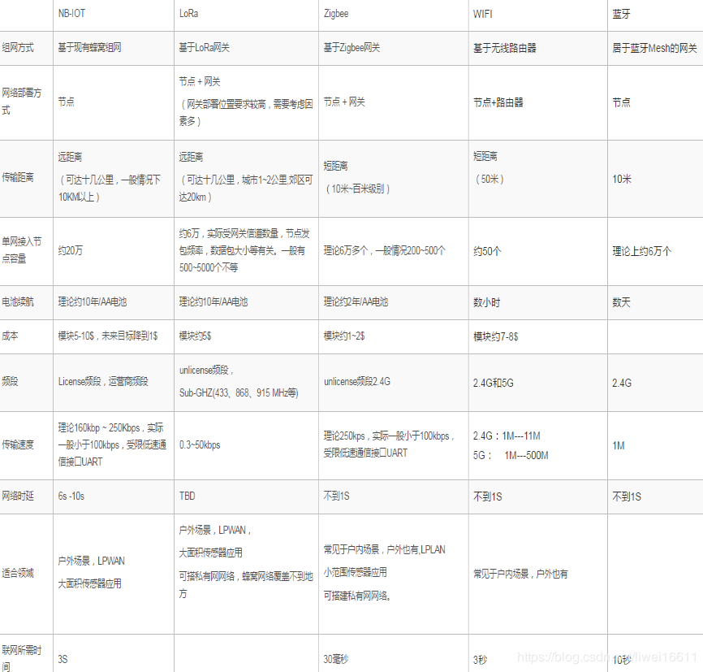

# WIFI, Zigbee 和 BlueTooth的区别

## WIFI

WIFI 是目前应用最广泛的无线通信技术，传输距离在 100~300M，速率可达 300Mbps，功耗 10-50mA。
WIFI 也是是一种短距离无线传输技术，可以随时接入无线信号，移动性强，比较适合在办公室及家庭的环境下应用。

当然 WIFI 也存在一个致命缺点：

由于 WIFI 采用的是射频技术，通过空气发送和接收数据，使用无线电波传输数据信号，比较容易受到外界的干扰。
数据包在传送的过程中都可以被外界检测或接收，信息安全是个隐患，虽然数据可以经过加密后传输，但在数据包足够多的情况下，仍有被黑客破解的可能。

## Zigbee

传输距离 50-300M，速率 250kbps，功耗 5mA，最大特点是可自组网，网络节点数最大可达 65000 个。

1）数据传输速率低

10Kb/s~250Kb/s，专注于低速率传输应用；

2）功耗低

在低功耗待机模式下，两节普通 5 号电池可使用 6~24 个月；

3）成本低

Zigbee 数据传输速率低，协议简单，所以大大降低了成本

4）网络容量大

网络可容纳 65000 个设备
　　
5）延时短

典型搜索设备时延为 30ms，休眠激活时延为 15ms，活动设备信道接入时延为 15ms。

6）网络的自组织、自愈能力强，通信可靠
　　
7）数据安全

Zigbee 提供了数据完整性检查和健全功能，采用 AES-128 加密算法，各个应用可灵活确定其安全属性，ZigBee 技术在低功耗、低成本和组网能力具有无可比拟的应用优势。

ZigBee 是国际通行的无线通讯技术，它的每个网络端口可以最多接入 6.5 万多个端口，适合家居、工业、农业等多个领域使用，而蓝牙和 WIFI 网端只能接入 10 个端口，显然不能适应家庭需要。

ZigBee 作为无线双向通信技术，具有自我检测功能，例如，它可随时反馈与查询灯光及电器等设备开关状态，如果是灯光还可以查询灯光亮度级数，可以查询系统中地址的分配情况。

## 蓝牙

传输距离 2-30M，速率 1Mbps，功耗介于 Zigbee 和 WIFI 之间。

蓝牙技术的出现使得短距离无线通信成为可能，但其协议较复杂、功耗高、成本高等特点不太适用于要求低成本、低功耗的工业控制和家庭网络。

尤其蓝牙最大的障碍在于传输范围受限，一般有效的范围在 10 米左右，抗干扰能力不强、信息安全问题等问题也是制约其进一步发展和大规模应用的主要因素。

## 性能对比

传输距离：

WIFI > ZigBee > 蓝牙

功耗：

WIFI > 蓝牙 > ZigBee，后两者仅靠电池供电即可满足要求。

传输速率：

WIFI > 蓝牙 > ZigBee

ZigBee 的优势是低功耗和自组网；

蓝牙的优势组网简单。

## ZigBee拓展

### ZigBee智能家居双向互动

值得注意的是，目前市场上的很多智能家居也打出无线的旗号，但客户在使用的过程中却发现，明明发送了指令，但执行的效果大打折扣，不如人意，例如，清晨离家时，主人拨动手机中的“离家”模式，本意是要关闭所有电器和电灯，以及启动智能安防功能，却由于信号不稳定，很可能安防功能就没有执行，以致于歹徒撬门而入，家中的传感器没有及时发出报警信号。

原来，现在很多采用433M/315M无线射频技术的智能家居都只有单向通信功能，即只能知道控制信号已经发送成功，但被控制信号的操作命令是否真正执行，被控制的设备是否已经开启或关闭，这是没法知道的。很显然，这种不能确认接受方的信息反馈传输模式，已经不能适应市场需求，必须采用双向通信技术，即当信号发送成功后，同时接收设备会把收到的信号即时反馈给发射器，也就是接收器既具有接收功能还具发射功能，ZigBee作为无线双向通信技术，具有自我检测功能，例如，它可随时反馈与查询灯光及电器等设备开关状态，如果是灯光还可以查询灯光亮度级数，可以查询系统中地址的分配情况。

基于ZigBee技术的无线智能家居由于采用碰撞避免机制，当主人用手持设备发送控制命令后，接受方就会立即回复确认的信息，如果没有收到回复的确认信息，就意味着发生了碰撞，就会再次发出控制命令，直到接受方回复确认信息为止，使得系统的传输非常可靠。物联传感推出的智能家居操作软件，比市场同类型的软件上就多了到指令确认回复功能，每个指令执行后，软件界面都有执行效果的确认和提示。

### 基于ZigBee技术的应用

随着ZigBee规范的进一步完善，许多公司均在着手开发基于ZigBee的产品。采用ZigBee技术的无线网络应用领域有家庭自动化、家庭安全、工业与环境控制与医疗护理、检测环境、监测、监察保鲜食品的运输过程及保质情况等等。其典型应用领域如下：

- 数字家庭领域

可以应用于家庭的照明、温度、安全、控制等。ZigBee模块可安装在电视、灯泡、遥控器、儿童玩具、游戏机、门禁系统、空调系统和其它家电产品等，例如在灯泡中装置ZigBee模块，则人们要开灯，就不需要走到墙壁开关处，直接通过遥控便可开灯。当你打开电视机时，灯光会自动减弱;当电话铃响起时或你拿起话机准备打电话时，电视机会自动静音。通过ZigBee终端设备可以收集家庭各种信息，传送到中央控制设备，或是通过遥控达到远程控制的目的，提供家居生活自动化、网络化与智能化。韩国第三大移动手持设备制造商Curitel Communications公司已经开始研制世界上第一款Zigbee手机，该手机将可通过无线的方式将家中或是办公室内的个人电脑、家用设备和电动开关连接起来。这种手机融入了“Zigbee”技术，能够使手机用户在短距离内操纵电动开关和控制其他电子设备。

- 工业领域

通过ZigBee网络自动收集各种信息，并将信息回馈到系统进行数据处理与分析，以利工厂整体信息之掌握，例如火警的感测和通知，照明系统之感测，生产机台之流程控制等，都可由ZigBee网络提供相关信息，以达到工业与环境控制的目的。韩国的NURI Telecom在基于Atmel和Ember的平台上成功研发出基于ZigBee技术的自动抄表系统。该系统无需手动读取电表、天然气表及水表，从而为公用事业企业节省数百万美元，此项技术正在进行前期测试，很快将在美国市场上推出。

- 智能交通

如果沿着街道、高速公路及其他地方分布式地装有大量ZigBee终端设备，你就不再担心会迷路。安装在汽车里的器件将告诉你，你当前所处位置，正向何处去。全球定位系统(GPS)也能提供类似服务，但是这种新的分布式系统能够向你提供更精确更具体的信息。即使在GPS覆盖不到的楼内或隧道内，你仍能继续使用此系统。从ZigBee无线网络系统能够得到比GPS多很多的信息，如限速、街道是单行线还是双行线、前面每条街的交通情况或事故信息等。使用这种系统，也可以跟踪公共交通情况，你可以适时地赶上下一班车，而不至于在寒风中或烈日下在车站等上数十分钟。基于ZigBee技术的系统还可以开发出许多其他功能，例如在不同街道根据交通流量动态调节红绿灯，追踪超速的汽车或被盗的汽车等。
